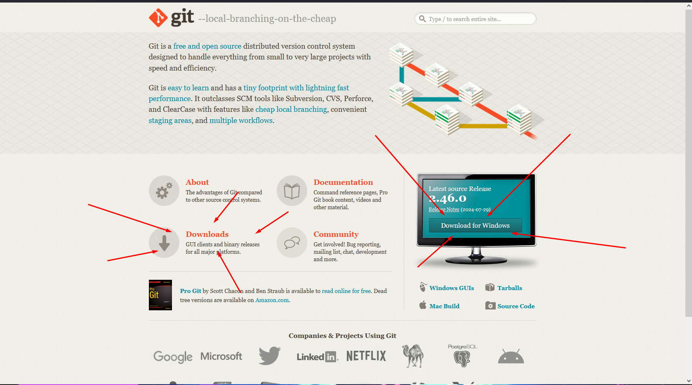
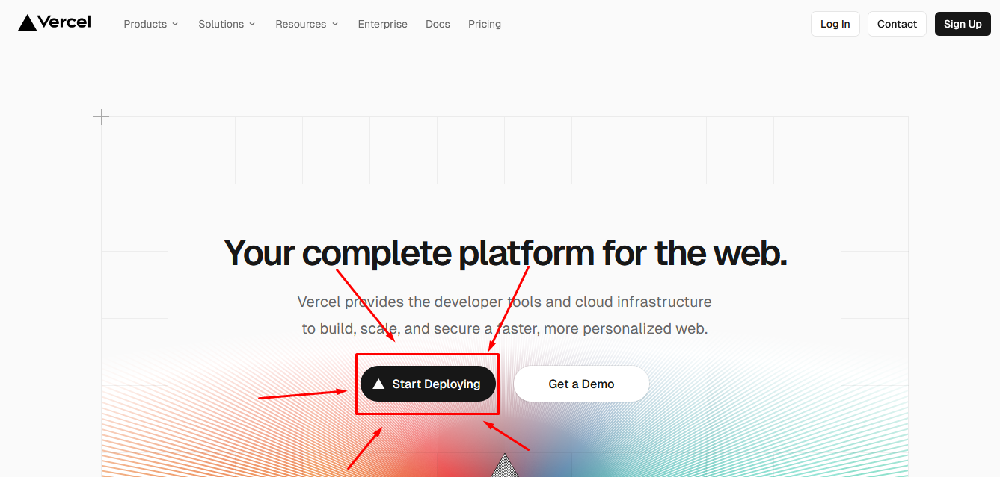
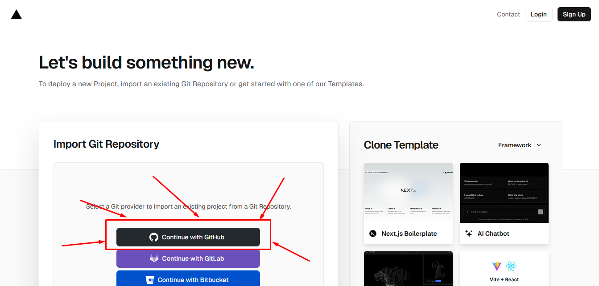

# **🌟 MTIP 🌟**

## **🚀 Створюємо сайт на платформі Vercel**

### **🛠️ Що нам знадобиться:**

- **🔗 Обліковий запис на GitHub**  
  Для завантаження файлів у Vercel.

- **📂 Система управління версіями GIT**  
  Для завантаження файлів на GitHub.

- **💻 IDE**  
  Зручне середовище для написання коду.

---

### **👉 Почнемо з GitHub:**

GitHub — це популярний сервіс для зберігання коду, де можна працювати над проєктами разом з іншими.  
Це ніби соціальна мережа для програмістів, де ти можеш показати свій код, подивитися на чужий і разом створювати щось круте. Але на разі зосередимо увагу на нашій задачі:

#### **📝 Створення облікового запису на GitHub:**

1. **🌐 Перейди по посиланню:** [github.com](https://github.com)  
   Здається, це найскладніше завдання! Далі просто потрібно зареєструватись.

2. **🔍 Знайди кнопку `Sign Up`:**  
   На даний момент дизайну сторінки вона знаходиться ось тут:

     
   Натисни.

3. **🖊️ Заповни дані:**  
   Далі все по стандарту: email, пароль, логін:

   

4. **🤖 Перевірка на людину:**  
   Добре, зайти на сайт було не складно (*кому-як*), але далі найскладніше: **ДОВЕДИ**, що ти не робот.

5. **✉️ Підтвердження пошти:**  
   Також забув, сказати використовуй справжню почту, бо треба пройти процес підтвердження.

---

##### 🎉 ***Вітаю! Ти створив свій аккаунт на GitHub***
Далі можеш заповнити інформацію про себе. Але це не дуже важливо.

---

### **🔄 Система управління версіями GIT:**

Git — це інструмент, який допомагає відстежувати всі зміни в коді.  
Уяви собі машину часу, яка дозволяє повернутися в минуле, якщо щось пішло не так, або поділитися своїм кодом з друзями, щоб разом працювати над проєктом.

---

### **🛠️ Встановлення GIT:**

1. **🌐 Переходимо до сайту:** [git-scm.com](https://git-scm.com)  
   Це офіційний сайт для завантаження GIT. Відкрий його в своєму браузері.

2. **📥 Обери свою операційну систему:**  
   У верхній частині сторінки знайди кнопку, яка відповідає твоїй операційній системі (Windows, macOS, Linux):

   

3. **💾 Завантаження:**  
   Натисни на кнопку завантаження. Після цього автоматично розпочнеться завантаження інсталяційного файлу GIT.

4. **📂 Встановлення:**  
   Після завершення завантаження, відкрий інсталяційний файл і дотримуйся інструкцій на екрані. Під час встановлення залишай стандартні налаштування.

   

   > **💡 До речі:** якщо ти просунутий користувач ПК, можеш встановити GIT за допомогою терміналу (PowerShell або cmd):
   > ```bash
   > winget install --id Git.Git -e --source winget
   > ```

   > **🐧 Для користувачів Linux:**
   > ```bash
   > Агов хлопці, ви на Linux, самі знаєте як встановлювати пакети на вашому дистрибутиві.
   > Для Debian: apt-get install git
   > ```

5. **✅ Перевірка:**  
   Після встановлення, відкрий командний рядок або термінал і введи команду:
  ```bash
   git --version
  ```

Якщо все пройшло вдало, ти побачиш версію GIT на своєму екрані.

---

##### 🎉 ***Вітаю! GIT успішно встановлений!***
Тепер ти готовий використовувати GIT для управління версіями свого коду.

---

### **💻 IDE та налаштування проекту:**

1. **💻 Відкрий своє IDE та створи новий проєкт.**

   > #### **Можливість використання GIT:**
   > Якщо не хочеш все робити вручну, можеш використати GIT і ввести в терміналі команду:
   > ```bash
   > git clone https://github.com/VadyKnyfy/skeleton_for_easily_vercel.git
   > ```

---

#### **💻 Це лише початок:**
Тут я розповідаю про те, як створити найпростіший проєкт, тому подано лише 2% інформації. Сподіваюся, що це зацікавить вас, і ви продовжите дізнаватися більше про світ IT.

---

2. **Створіть у корені проєкту два каталоги:** `public` та `api`.  
   Це будуть два основних каталоги: `public` для статичних файлів, усі файли будуть викликатися з цієї папки, `api` — для серверних.

   

3. **Створіть файл `vercel.json`:**  
   Додайте до нього наступний код (*магічні символи*):

   ```json
   {
     "functions": {
       "api/**/*.php": {
         "runtime": "vercel-php@0.6.1"
       }
     },
     "routes": [
       {
         "src": "/api/(.*)",
         "dest": "/api/$1"
       }
     ]
   }
   ```
**🛠️ Functions:**

- **Functions** використовуються для виконання серверних скриптів. Це дуже корисна річ! Більше інформації тут: 👉 [Vercel Functions](https://vercel.com/docs/functions/runtimes).

**🔄 Routes:**

- **Routes** використовуються для перенаправлення запитів, щоб отримати файли з будь-якої вигаданої адреси на фактичну адресу файлу. Як це працює:

  Уяви, що у нас є документ за адресою `/public/src/dangers/dota2.html`. Замість того, щоб використовувати таку URL-адресу: `http://наш_сайт/src/dangers/dota2.html` (де `public` не включено, бо Vercel шукає файли там за замовчуванням), ми можемо створити коротшу URL-адресу: `http://наш_сайт/league_of_legends`.

  Щоб це зробити потрібно додати ось такий код(*магічні символи*) у масив `routes`:

  ```json
  {
    "src": "/league_of_legends",
    "dest": "/src/dangers/dota2.html"
  }
   ``` 
   - `src`: бажана адреса для переходу до документа.
   - `dest`: фактична адреса до документа.

Зараз ми налаштували маршрути так, щоб усі документи з адресою, що починається з `/api/...`, шукалися в директорії `api`, яку ми створили раніше.

4. **Створи файл `package.json`:**  
   Корисний файл, але нами він буде використовуватись лише для того, щоб встановити версію, ядра, тож введи в нього, ось такий код(*магічні символи*):
   ```json
      { "engines": { "node": "18.x" } }
   ``` 
5. **Створимо файл, для перевірки**:
   Перейди до каталогу public та створи файл `index.html`, та заповни його базовою структурою html, використовуючи *магічні символи*, або код(мій тестовий документ):
   ```html
    <!DOCTYPE html>
    <html lang="en">
         <head>
             <meta charset="UTF-8">
             <title>Найпростіший Vercel проект</title>
         </head>
         <body>
             <h1>
                 Усе працює
             </h1>
             <p>
                 Сторінка створена з допомогою магії
             </p>
         </body>
     </html>
   ```   
   Перейди до каталогу api та створи файл `index.php`, заповни його цим:
   ```php
   <?php
   phpinfo();
   ?>
   ```
---
##### 🎉 ***Вітаю! Проект успішно створено!***
>   > далі нас очікує завантаження, його на GITHUB, та довгождана інтеграція з Vercel
---

### **💻 Створення нового репозиторію на GITHUB та завантаження проекту:**

1. **Перейди на сторінку [GitHub](https://www.github.com)**

2. Якщо в тебе ще немає жодного репозиторію, шукай кнопку `Create repository`, як показано на рисунку:

   

   Натискай її.

3. Далі потрібно заповнити форму. Обов'язково введи лише назву репозиторію, усе інше можеш залишити так, як є:

   

   Потім натисни на кнопку `Create repository`.

#### **Репозиторій створено**

4. Далі скопіюй вміст поля з написом `…or create a new repository on the command line`:

   

   Після того як скопіював, встав скопійований текст у термінал. **Переконайся, що в терміналі відкритий корінь твого проєкту**.
Очікуй, на появлення вікна для авторизації Git на GitHub:
, або авторизація пройде у терміналі де потрібно ввести дані для входу у твій профіль GitHub

5. Тепер твій проєкт зареєстрований у системі GIT, але ще треба завантажити файли. Введи у терміналі наступні команди:

   ```bash
   git add --all
   git commit -m "init"
   git push -u origin main
    ```
#### **Перейди на сторінку GitHub свого репозиторію та онови сторінку, якщо ти бачиш файли, які ти створив у себе на ПК...**

---

##### 🎉 ***Вітаю! Проєкт успішно завантажений на GitHub!***

---
### **🚀 Розгортання проєкту на Vercel:**

1. **🌐 Перейди на сторінку [Vercel](https://vercel.com/)**

2. **🔹 Натисни кнопку `Start Deploying`:**  
   

3. **🔹 Натискай кнопку `Continue with GitHub`:**  
   

4. **🔹 У вікні, що з'явиться, вибери профіль GitHub зі створеним тобою проєктом та натисни кнопку `Authorize Vercel`.**

5. **🔹 У вікні, що з'явиться, знайди свій проєкт та натисни на кнопку `Import`:**  
   

6. **🔹 У вікні конфігурації натисни кнопку `Deploy`:**  
   

7. **🔹 Почнеться процес розгортання проєкту. Коли він закінчиться, тебе автоматично переадресує на сторінку твого сайту!**

8. **🔹 Натисни на це вікно:**  
     
   **і ти перейдеш на свій проєкт, розміщений на платформі Vercel.**

### 🎉 ***Вітаю! Проєкт успішно розміщено на платформі Vercel***

---

## ***Робота з файлами та оновлення вмісту сторінки***

На разі усе не дуже й складно, розберемо як на наш скелет накинути статичні файли. Розробимо базову структуру проєкту, та напишемо 2 html сторінки, та налаштуємо роутер для них

Створемо базову структуру у каталозі public:

>public
>   ↪ [
>      src
>         ↪[
>            views
>              ↪[
>                 page1
>                 page2
>                ]    
>          ]
>      img
>      external
>      ]

де у папці src/views - будемо зберігати каталоги з файлами сторінок
отже створимо 2 файли src/views/page1/template.html та src/views/page1/template.css

.../page1/template.html:
```html
   <!DOCTYPE html>
<html lang="uk">
<head>
   <meta charset="UTF-8">
   <meta name="viewport" content="width=device-width, initial-scale=1.0">
   <title>Мій перший проект на Vercel</title>
   <link rel="stylesheet" href="/src/views/page1/template.css">
</head>
<body>
<header>
   <h1>Мій перший проект на Vercel</h1>
</header>

<main>
   <button onclick="window.location.href='/src/views/page2/template.html';">Перейти на іншу сторінку</button>
</main>
</body>
</html>
```

---

.../page1/template.css:
```css
/* Загальні стилі */
body {
    font-family: 'Arial', sans-serif;
    margin: 0;
    padding: 0;
    background-color: #f0f8ff;
    display: flex;
    flex-direction: column;
    align-items: center;
    justify-content: center;
    height: 100vh;
}

/* Стилі для хедера */
header {
    position: absolute;
    top: 20px;
    width: 100%;
    text-align: center;
}

header h1 {
    font-size: 2rem;
    color: #333;
    margin: 0;
}

/* Стилі для кнопки */
main button {
    font-size: 1.5rem;
    padding: 10px 20px;
    background-color: #007bff;
    color: white;
    border: none;
    border-radius: 5px;
    cursor: pointer;
    transition: background-color 0.3s ease;
}

main button:hover {
    background-color: #0056b3;
}
```
Як бачимо на сторінці є кнопка, що буде відсилати нас до `src/views/page2/template.html`, тож створимо ще 2 файла:

.../page2/template.html:
```html
<!DOCTYPE html>
<html lang="uk">
<head>
    <meta charset="UTF-8">
    <meta name="viewport" content="width=device-width, initial-scale=1.0">
    <title>Друга сторінка</title>
   <link rel="stylesheet" href="/src/views/page2/template.css">
</head>
<body>
    <header>
        <h1>Мій перший проект на Vercel</h1>
    </header>

    <main>
        <p>Це друга сторінка</p>
        <button onclick="window.location.href='/src/views/page1/template.html';">Повернутися назад</button>
    </main>
</body>
</html>
```

.../page2/template.css:
```css
   /* Загальні стилі */
body {
   font-family: 'Arial', sans-serif;
   margin: 0;
   padding: 0;
   background-color: #f0f8ff;
   display: flex;
   flex-direction: column;
   align-items: center;
   justify-content: center;
   height: 100vh;
}

/* Стилі для хедера */
header {
   position: absolute;
   top: 20px;
   width: 100%;
   text-align: center;
}

header h1 {
   font-size: 2rem;
   color: #333;
   margin: 0;
}

/* Стилі для головного блоку */
main p {
   font-size: 1.5rem;
   color: #333;
   margin-bottom: 20px;
}

/* Стилі для кнопки */
main button {
   font-size: 1.5rem;
   padding: 10px 20px;
   background-color: #007bff;
   color: white;
   border: none;
   border-radius: 5px;
   cursor: pointer;
   transition: background-color 0.3s ease;
}

main button:hover {
   background-color: #0056b3;
}

```

Коли ми створили усі ці файли, спробуємо оновити їх на платформі Vercel, для цього потрібно оновити файли, на GitHub
У терміналі(*Незабувайте перевірити, щоб у терміналі був відкритий саме коренева директорія проєкту*), вписуємо ось ці команди:
```bash
git add --all
git commit -m update
git push origin main
```

Після цього, оновлення завантажиться до GitHub, а Vercel автоматично почне розгортати оновлення, тож треба трішки почекати.
Перейдіть до своєї сторінки у браузері
Як бачите на сайті наша стартова сторінка:
, для того щоб перейти на сторінку яку ми створили, впишіть у url: `https://[ваш домен]/src/views/page1/template.html`:
.
Сторінка створена, але перехід на неї мені не дуже подобається тож, давайте налаштуємо маршрутизатор до сторінок так, щоб при переході на сторінку в нас відоражалась наша сторінка page1, а при переході на `https://[ваш домен]/page2`, выдображалась наша друга сторінка:

Тож змінено файл vercel.json:
```json
{
  "functions": {
    "api/**/*.php": {
      "runtime": "vercel-php@0.6.1"
    }
  },
  "routes": [
    {
      "src": "/api/(.*)",
      "dest": "/api/$1"
    },
    {
      "src": "/",
      "dest": "/src/views/page1/template.html"
    },
    {
      "src": "/page2",
      "dest": "/src/views/page2/template.html"
    }
  ]
}
```

та змінемо посилання на сторінках:

.../page1/template.html
```html
<main>
   <button onclick="window.location.href='/page2';">Перейти на іншу сторінку</button>
</main>
```
.../page2/template.html
```html
 <main>
   <p>Це друга сторінка</p>
   <button onclick="window.location.href='/';">Повернутися назад</button>
</main>
```

Та знову оновимо наш проект:
```bash
git add --all
git commit -m update
git push origin main
```
Після, того як Vercel обробить оновлення, перейдемо на наш сайт.
