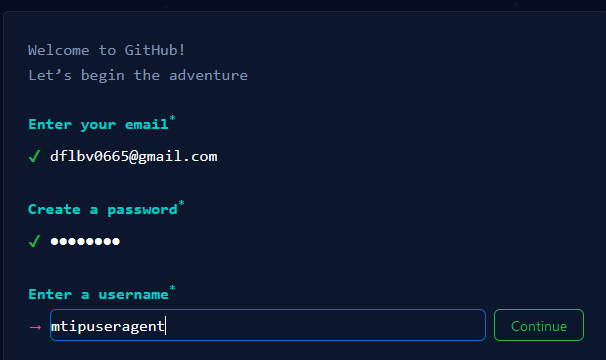
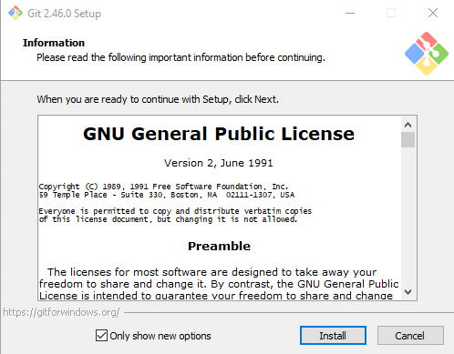

# **🌟 MTIP 🌟**

## **🚀 Створюємо сайт на платформі Vercel**

### **🛠️ Що нам знадобиться:**

- **🔗 Обліковий запис на GitHub**  
  Для завантаження файлів у Vercel.

- **📂 Система управління версіями GIT**  
  Для завантаження файлів на GitHub.

- **💻 IDE**  
  Зручне середовище для написання коду.

---

### **👉 Почнемо з GitHub:**

GitHub — це популярний сервіс для зберігання коду, де можна працювати над проєктами разом з іншими.  
Це ніби соціальна мережа для програмістів, де ти можеш показати свій код, подивитися на чужий і разом створювати щось круте. Але на разі зосередимо увагу на нашій задачі:

#### **📝 Створення облікового запису на GitHub:**

1. **🌐 Перейди по посиланню:** [github.com](https://github.com)  
   Здається, це найскладніше завдання! Далі просто потрібно зареєструватись.

2. **🔍 Знайди кнопку `Sign Up`:**  
   На даний момент дизайну сторінки вона знаходиться ось тут:

     
   Натисни.

3. **🖊️ Заповни дані:**  
   Далі все по стандарту: email, пароль, логін:

   

4. **🤖 Перевірка на людину:**  
   Добре, зайти на сайт було не складно (*кому-як*), але далі найскладніше: **ДОВЕДИ**, що ти не робот.

5. **✉️ Підтвердження пошти:**  
   Також забув, сказати використовуй справжню почту, бо треба пройти процес підтвердження.

---

##### 🎉 ***Вітаю! Ти створив свій аккаунт на GitHub***
Далі можеш заповнити інформацію про себе. Але це не дуже важливо.

---

### **🔄 Система управління версіями GIT:**

Git — це інструмент, який допомагає відстежувати всі зміни в коді.  
Уяви собі машину часу, яка дозволяє повернутися в минуле, якщо щось пішло не так, або поділитися своїм кодом з друзями, щоб разом працювати над проєктом.

---

### **🛠️ Встановлення GIT:**

1. **🌐 Переходимо до сайту:** [git-scm.com](https://git-scm.com)  
   Це офіційний сайт для завантаження GIT. Відкрий його в своєму браузері.

2. **📥 Обери свою операційну систему:**  
   У верхній частині сторінки знайди кнопку, яка відповідає твоїй операційній системі (Windows, macOS, Linux):

   

3. **💾 Завантаження:**  
   Натисни на кнопку завантаження. Після цього автоматично розпочнеться завантаження інсталяційного файлу GIT.

4. **📂 Встановлення:**  
   Після завершення завантаження, відкрий інсталяційний файл і дотримуйся інструкцій на екрані. Під час встановлення залишай стандартні налаштування.

   

   > **💡 До речі:** якщо ти просунутий користувач ПК, можеш встановити GIT за допомогою терміналу (PowerShell або cmd):
   > ```bash
   > winget install --id Git.Git -e --source winget
   > ```

   > **🐧 Для користувачів Linux:**
   > ```bash
   > Агов хлопці, ви на Linux, самі знаєте як встановлювати пакети на вашому дистрибутиві.
   > Для Debian: apt-get install git
   > ```

5. **✅ Перевірка:**  
   Після встановлення, відкрий командний рядок або термінал і введи команду:
  ```bash
   git --version
  ```

Якщо все пройшло вдало, ти побачиш версію GIT на своєму екрані.

---

##### 🎉 ***Вітаю! GIT успішно встановлений!***
Тепер ти готовий використовувати GIT для управління версіями свого коду.

---

### **💻 IDE та налаштування проекту:**

1. **💻 Відкрий своє IDE та створи новий проєкт.**

   > #### **Можливість використання GIT:**
   > Якщо не хочеш все робити вручну, можеш використати GIT і ввести в терміналі команду:
   > ```bash
   > git clone <тут я вставлю посилання на свій GitHub з пустим проектом>
   > ```

---

#### **💻 Це лише початок:**
Тут я розповідаю про те, як створити найпростіший проєкт, тому подано лише 2% інформації. Сподіваюся, що це зацікавить вас, і ви продовжите дізнаватися більше про світ IT.

---

2. **Створіть у корені проєкту два каталоги:** `public` та `api`.  
   Це будуть два основних каталоги: `public` для статичних файлів, усі файли будуть викликатися з цієї папки, `api` — для серверних.

   

3. **Створіть файл `vercel.json`:**  
   Додайте до нього наступний код (*магічні символи*):

   ```json
   {
     "functions": {
       "api/**/*.php": {
         "runtime": "vercel-php@0.6.1"
       }
     },
     "routes": [
       {
         "src": "/api/(.*)",
         "dest": "/api/$1"
       }
     ]
   }
   ```
**🛠️ Functions:**

- **Functions** використовуються для виконання серверних скриптів. Це дуже корисна річ! Більше інформації тут: 👉 [Vercel Functions](https://vercel.com/docs/functions/runtimes).

**🔄 Routes:**

- **Routes** використовуються для перенаправлення запитів, щоб отримати файли з будь-якої вигаданої адреси на фактичну адресу файлу. Як це працює:

  Уяви, що у нас є документ за адресою `/public/src/dangers/dota2.html`. Замість того, щоб використовувати таку URL-адресу: `http://наш_сайт/src/dangers/dota2.html` (де `public` не включено, бо Vercel шукає файли там за замовчуванням), ми можемо створити коротшу URL-адресу: `http://наш_сайт/league_of_legends`.

  Щоб це зробити потрібно додати ось такий код(*магічні символи*) у масив `routes`:

  ```json
  {
    "src": "/league_of_legends",
    "dest": "/src/dangers/dota2.html"
  }
   ``` 
   - `src`: бажана адреса для переходу до документа.
   - `dest`: фактична адреса до документа.

Зараз ми налаштували маршрути так, щоб усі документи з адресою, що починається з `/api/...`, шукалися в директорії `api`, яку ми створили раніше.

4. **Створи файл `package.json`:**  
   Корисний файл, але нами він буде використовуватись лише для того, щоб встановити версію, ядра, тож введи в нього, ось такий код(*магічні символи*):
   ```json
      { "engines": { "node": "18.x" } }
   ``` 
5. **Створимо файл, для перевірки**:
   Перейди до каталогу public та створи файл `index.html`, та заповни його базовою структурою html, використовуючи *магічні символи*, або код(мій тестовий документ):
   ```html
    <!DOCTYPE html>
    <html lang="en">
         <head>
             <meta charset="UTF-8">
             <title>Найпростіший Vercel проект</title>
         </head>
         <body>
             <h1>
                 Усе працює
             </h1>
             <p>
                 Сторінка створена з допомогою магії
             </p>
         </body>
     </html>
   ```   
---
##### 🎉 ***Вітаю! Проект успішно створено!***
>   > далі нас очікує завантаження, його на GITHUB, та довгожданна інтеграція з Vercel
---


